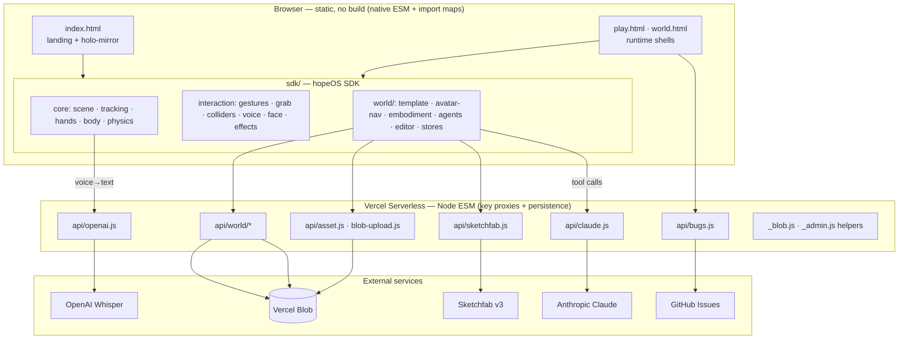
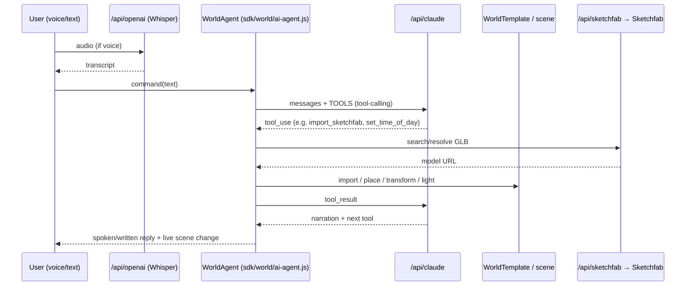

# hopeOS — Architecture

A reference for how the full system is built: the layers, the runtime, the SDK modules,
the serverless API, the data model, and the cross-cutting concerns. See
[CONCEPT.md](CONCEPT.md) for the product vision and [BACKLOG.md](BACKLOG.md) for
recommendations.

---

## 1. System overview

hopeOS is a **static site + Vercel serverless functions**. There is **no bundler and no
build step**: pages load native ES modules through an HTML **import map**, and all
third-party libraries are pulled from CDNs at runtime. Secrets never reach the browser —
the client calls thin `/api/*` proxies that add keys server-side.



---

## 2. Layered model

hopeOS is organized as stacked layers; each only depends on the one below it.

```
┌───────────────────────────────────────────────────────────────────────┐
│  L6  AI Co-Creation   ai-agent.js · world-builder.js (Claude tools)     │
├───────────────────────────────────────────────────────────────────────┤
│  L5  World Layer      template.js · avatar-nav.js · embodiment.js       │
│                       editor.js · selection.js · world-store/-graph     │
├───────────────────────────────────────────────────────────────────────┤
│  L4  Interaction      gestures · body-gestures · grab · colliders ·     │
│                       voice · face · effects                            │
├───────────────────────────────────────────────────────────────────────┤
│  L3  Core Runtime     scene · tracking · hands · body · physics         │
├───────────────────────────────────────────────────────────────────────┤
│  L2  Platform libs    three.js · Rapier · cannon-es · MediaPipe (CDN)   │
├───────────────────────────────────────────────────────────────────────┤
│  L1  Delivery         static HTML + Vercel rewrites/headers (vercel.json)│
├───────────────────────────────────────────────────────────────────────┤
│  L0  Services         Claude · Whisper · Sketchfab · Blob · GitHub       │
└───────────────────────────────────────────────────────────────────────┘
```

---

## 3. Technology stack

### 3.1 Client libraries (loaded from CDN at runtime)

| Library | Version | Loaded by | Purpose |
|---|---|---|---|
| **Three.js** (global UMD) | r128 | [index.html](index.html) | Landing-page background grid only |
| **Three.js** (ESM + addons) | 0.160.0 | [play.html](play.html), [world.html](world.html) | Runtime renderer, GLTF/DRACO loaders, RoomEnvironment IBL |
| **@dimforge/rapier3d-compat** | 0.14.0 | [world.html](world.html), [sdk/world/template.js](sdk/world/template.js) | World-layer physics: trimesh colliders + kinematic character controller |
| **cannon-es** | 0.20.0 | [sdk/core/physics.js](sdk/core/physics.js) | AR/DEI-layer physics: floor + body capsules |
| **@mediapipe/tasks-vision** | 0.10.14 | [index.html](index.html), `sdk/core/tracking.js` | On-device hand + pose landmark detection (GPU delegate, WASM) |
| **three-mesh-bvh** | — | `sdk/interaction/colliders.js` | BVH acceleration for hand↔mesh collision |
| **@vercel/blob/client** | latest (esm.sh) | [world.html](world.html) | Direct client→Blob upload for large GLBs |

> Dependency strategy: every client lib is a **version-pinned CDN URL**. The only npm
> dependency in [package.json](package.json) is `@vercel/blob` (used by the serverless
> functions). Import maps in the runtime HTML resolve bare specifiers (`three`,
> `three/addons/`, `@dimforge/rapier3d-compat`).

### 3.2 Server runtime
- **Vercel Serverless Functions** (Node, ESM, `"type": "module"`).
- **@vercel/blob** for object storage (worlds + GLB assets + bug reports).
- Routing, caching, and clean URLs declared in [vercel.json](vercel.json).

### 3.3 External services
- **Anthropic Claude** — `claude-sonnet-4-6` (converse / "design pal") and
  `claude-opus-4-8` (build agent), via [api/claude.js](api/claude.js).
- **OpenAI** — `gpt-4o-transcribe` (Whisper-style speech→text) via [api/openai.js](api/openai.js).
- **Sketchfab API v3** — model search + download resolution via [api/sketchfab.js](api/sketchfab.js).
- **GitHub Issues API** — auto-filed bug reports via [api/bugs.js](api/bugs.js).

---

## 4. The runtime (client)

### 4.1 Pages and routes
Clean URLs are mapped to static HTML in [vercel.json](vercel.json):

| Route | File | Role |
|---|---|---|
| `/` | [index.html](index.html) | Landing + live holo-mirror preview |
| `/play` | [play.html](play.html) | World runtime player |
| `/build`, `/world/:name` | [world.html](world.html) | World builder + editor + player |
| `/worlds`, `/you` | [graph.html](graph.html) | World graph / personal library |
| `/admin` | [admin.html](admin.html) | Owner dashboard (gated reads) |

All JS/HTML/SDK/world responses are served `cache-control: max-age=0, must-revalidate` —
deliberate for a no-build, live-editing engine where staleness would break the agent's
tool contract.

### 4.2 SDK entry point
[sdk/hopeos.js](sdk/hopeos.js) exposes `window.hopeOS`. `HopeOS.init({...})` wires the
whole stack and returns a handle:

```js
const hope = await HopeOS.init({ canvas, bgVideo, detectionVideo, worldMode });
hope.gestures.on('punch', (side, v) => { ... });
const sword = await hope.loadModel('sword.glb', { collider: 'mesh', scale: 0.4 });
hope.onFrame((dt, frame) => { /* frame.hands, frame.pose, frame.face ... */ });
hope.start();
```

`init` is intentionally fault-tolerant: tracking (webcam) is fire-and-forget and never
blocks boot; a missing hand model logs a warning and continues; a slow BVH/CDN never hangs
startup. In `worldMode`, lights come from `WorldTemplate`, body capsules are hidden, and
the camera starts **off** for privacy.

### 4.3 Core modules (`sdk/core/`)

| Module | Responsibility |
|---|---|
| `scene.js` | Three.js scene/camera/renderer, screen-space mapping (`mp2s`), render loop primitives |
| `tracking.js` | Webcam capture + MediaPipe hand/pose inference; produces per-frame landmarks |
| `hands.js` | `RiggedHand` holo-hand mesh + 42-point rest poses (`REST_R42/L42`); `deform()` from landmarks |
| `body.js` | `BodyTracker` holo-body skeleton + `BODY_SEGS` capsule segments |
| `physics.js` | `PhysicsWorld` (cannon-es): floor plane + body collision capsules |

### 4.4 Interaction modules (`sdk/interaction/`)

| Module | Responsibility |
|---|---|
| `colliders.js` | Sphere/mesh collider registry + BVH (`registerMeshAsync`, `awaitBVH`) |
| `gestures.js` / `body-gestures.js` | Hand-shape and body-pose gesture detection (punch, swipe, point, fist…) |
| `grab.js` | Pinch detection, palm center, hand quaternion, `GrabState` |
| `voice.js` | `VoiceCommander` — mic capture + Whisper transcription + command registry |
| `face.js` | `FaceExpressionDetector` — blendshapes/expressions |
| `effects.js` | Visual effects (e.g. `FireEffect`) |

### 4.5 World Layer (`sdk/world/`)

| Module | Responsibility |
|---|---|
| `template.js` | `WorldTemplate` — load + auto-center/scale/ground a GLB, generate Rapier trimesh colliders, fit sun shadow frustum, run the kinematic capsule avatar (`step/look/jump`), atmosphere controls |
| `avatar-nav.js` | `AvatarNavigator` — keyboard **or** gesture → unified `intent`; all thresholds in `NAV_DEFAULTS` |
| `embodiment.js` | `EmbodimentManager` — first-person vs body-embedded camera + hand remapping; SAM2 silhouette hook |
| `selection.js` | `SelectionManager` — mark surfaces/regions to build against |
| `editor.js` / `asset-grab.js` | Direct manipulation; re-syncs Rapier colliders + BVH on transform |
| `asset-browser.js` / `sketchfab.js` | Asset search/import client wrappers |
| `world-store.js` | Save/load snapshots: IndexedDB library + `exportFile`/`importFile` (portable JSON) |
| `world-graph.js` / `world-builder.js` | World graph view; conversational scene bring-up (`BuilderAgent`) |
| `ai-agent.js` | `WorldAgent` — the in-runtime Claude co-creator + tool executor |
| `grid3d.js` · `surface-trace.js` · `embodiment.js` | Spatial helpers (grid, surface tracing) |

### 4.6 Per-frame loop (world mode)

```
1. nav.update(dt, frame)          → intent { forward, strafe, yawDelta, pitchDelta, jump, sprint }
2. world.step(dt, intent)         → physics, collision, gravity, character controller
3. embody.updateCamera(world,cam) → eyes (first-person) or follow (body-embedded)
4. embody.resolveHands(frame,…)   → remapped landmarks → RiggedHand.deform()
5. render
```

The decoupling is the key architectural move: **both inputs emit the same `intent`** and
**both embodiment modes resolve to the same `deform()`** — so adding scenes or input
methods never touches the template.

---

## 5. The AI agent subsystem



The agent exposes a large tool surface (understanding: `get_scene`, `select_in_view`;
spatial selection: `mark_surface_in_view`, `mark_region`, `place_in_selection`,
`fill_selection`; import: `import_sketchfab`, `search_assets`, `import_model`,
`import_glb_url`; editing: translate/rotate/scale/color/duplicate/delete; atmosphere:
`set_time_of_day`, `set_sun`, `set_atmosphere`, `set_skybox`, `set_shadows`; and a
`run_script` escape hatch with `world/scene/camera/THREE/hope/nav` in scope). The
`BuilderAgent` ([sdk/world/world-builder.js](sdk/world/world-builder.js)) is the front
door that turns a vibe into a `browse_scenes` query, with a non-AI fallback that searches
Sketchfab directly when no key/model is available.

---

## 6. Serverless API (`api/`)

All functions are thin and stateless. Files prefixed `_` are **helpers, not routes**.

| Endpoint | Method | Purpose | Secrets / env |
|---|---|---|---|
| [api/claude.js](api/claude.js) | POST | Forward Anthropic Messages body | `ANTHROPIC_API_KEY` |
| [api/openai.js](api/openai.js) | POST | Rebuild multipart, forward audio→transcription | `OPENAI_API_KEY` |
| [api/sketchfab.js](api/sketchfab.js) | GET | `op=search` / `op=resolve` model lookups | `SKETCHFAB_TOKEN` |
| [api/asset.js](api/asset.js) | POST | Host a world's base GLB (raw bytes) on Blob | Blob token |
| [api/blob-upload.js](api/blob-upload.js) | POST | Client-token handshake for large direct uploads | Blob token |
| [api/world/index.js](api/world/index.js) | GET | List published worlds (public library) | Blob token |
| [api/world/[name]/index.js](api/world/[name]/index.js) | GET/POST | Read/write a world snapshot | Blob token |
| [api/world/[name]/activity.js](api/world/[name]/activity.js) | — | Per-world activity | Blob token |
| [api/bugs.js](api/bugs.js) | GET/POST | Store bug + screenshot in Blob, auto-file GitHub issue | Blob, `GITHUB_TOKEN`, `GITHUB_REPO` |
| [api/_blob.js](api/_blob.js) | helper | Resolve Blob token by name **or** by `vercel_blob_rw_` value prefix | — |
| [api/_admin.js](api/_admin.js) | helper | `requireAdmin` gate (`x-admin-key` / `?key=`) for owner reads | `ADMIN_KEY` |

**The proxy pattern:** the browser sends a request shaped for the upstream API; the
function injects the secret header server-side and forwards. The key never ships to the
client. Leaving the client-side `*_API_KEY` fields empty in [config.js](config.js) /
[dei_config.js](dei_config.js) routes everything through these proxies.

---

## 7. Data model & persistence

### 7.1 World snapshot (portable JSON)
Produced by [sdk/world/world-store.js](sdk/world/world-store.js):

```jsonc
{
  "name": "marble-gallery",
  "createdAt": "…", "updatedAt": "…",
  "base":   { "source": "sketchfab|url|upload|default", "url": "…", "uid": "…",
              "blob": "data:…", "autoScale": true, "targetSpan": 24 },
  "avatar": { "spawn": [0, 1.5, 0], "yaw": 0, "pitch": 0 },
  "objects": [
    { "label": "dragon", "kind": "import",   "url": "…",
      "position": [x,y,z], "rotationDeg": [x,y,z], "scale": 1.0 },
    { "label": "gold orb", "kind": "primitive", "ptype": "sphere", "color": "#d4a843",
      "position": [x,y,z], "rotationDeg": [x,y,z], "scale": 1.0 }
  ]
}
```

### 7.2 Two-tier persistence

| Tier | Store | Scope | Behavior |
|---|---|---|---|
| **Draft / Library** | IndexedDB (`hopeOS-worlds`) | This browser/device | Instant save/list/reopen; survives reloads; private until published |
| **Published** | Vercel Blob (`worlds/<name>.json` + `world-assets/<name>.glb`) | Public, all devices | Stable URL `h0p3.io/world/<name>`; appears in the communal graph |

Raw GLB bytes (not base64) are uploaded to avoid the ~33% data-URL inflation that pushes
past Vercel's ~4.5 MB function-body limit; larger scenes fall back to a direct client
upload (`/api/blob-upload`). Blob content is CDN-cached as immutable per-URL.

---

## 8. Cross-cutting concerns

### 8.1 Security
- **Secrets server-side only.** All keys in Vercel env vars; the browser calls `/api/*`.
- **Admin gate** ([api/_admin.js](api/_admin.js)) protects owner-only *reads* (chat log,
  bug list); public *writes* (bug report) stay open.
- **Blob token resilience** ([api/_blob.js](api/_blob.js)) handles custom/multi-store names.
- ⚠️ **Open proxies.** [api/claude.js](api/claude.js) and [api/openai.js](api/openai.js)
  forward arbitrary bodies with no auth/rate-limit/origin check — see [BACKLOG.md](BACKLOG.md).

### 8.2 Resilience / graceful degradation
- Camera/tracking is optional and fire-and-forget; failure logs and continues.
- AI is an *enhancer, not a gate*: missing key/model falls back to direct Sketchfab search,
  upload, and URL import.
- Slow CDN/BVH never blocks boot.

### 8.3 Privacy
- World mode starts camera **off**; mic requested only on voice toggle (`VOICE_DEFAULT_ON: false`).
- On-device ML (MediaPipe) — landmark inference runs in the browser, not server-side.

### 8.4 Coordinate & units contract
- **Metres, Y-up, right-handed** (matches Three.js + Unity). Floor at `y = 0` (`groundY`).
- Imports auto-normalize to ≈1.5 m longest side; avatar capsule ≈0.56 m wide, eye ≈1.8 m.

### 8.5 Configuration
- [config.js](config.js) (main) and [dei_config.js](dei_config.js) (camera POV) — both
  client-side, **no secrets**. Model tiers (`CLAUDE_MODEL_CONVERSE` / `CLAUDE_MODEL_BUILD`)
  live only in `config.js`.

---

## 9. Known architectural tensions

These are summarized here and tracked with proposed actions in [BACKLOG.md](BACKLOG.md):

1. **Two physics engines** — cannon-es (core/AR) and Rapier (world layer) coexist.
2. **Three.js version split** — r128 global on the landing page vs 0.160 modules at runtime.
3. **Unpinned supply chain** — CDN deps without SRI; versions string-managed across files.
4. **Open AI proxies** — no auth/rate-limit/origin enforcement on paid endpoints.
5. **Duplicated config** — `config.js` vs `dei_config.js` risk drift.
