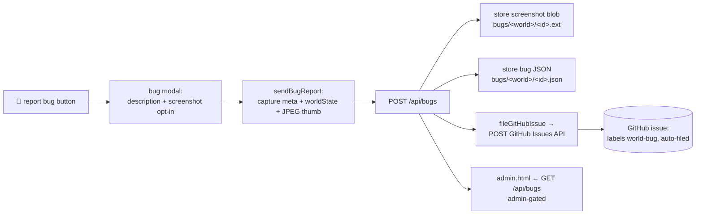

# hopeOS — Bug Reporting

How a bug report travels from a button in the world runtime all the way to an auto-filed
GitHub issue. See [ARCHITECTURE.md](ARCHITECTURE.md) for system context and
[BACKLOG.md](BACKLOG.md) for related hardening recommendations.

---

## 1. Overview

Bug reporting is a four-stage pipeline:

1. **UI trigger** — a 🐛 button in the world runtime opens a report modal.
2. **Client capture** — the page gathers a description, a screenshot, session metadata,
   and the live world state.
3. **Serverless intake** — `POST /api/bugs` persists everything to Vercel Blob.
4. **GitHub issue** — the same function opens a labeled GitHub issue with the details.

The report path is **public** (any visitor can file a bug). Reading the backlog is
**admin-gated**.



---

## 2. The UI trigger (`world.html`)

A fixed **🐛 report bug** button sits at the bottom-right of the world runtime
([world.html](world.html#L298)). Clicking it opens a modal ([world.html](world.html#L302))
containing:

- a **description** textarea (required),
- an **"attach screenshot of my view"** checkbox (checked by default),
- a status line, and **cancel** / **send report** buttons.

Handlers are wired at [world.html](world.html#L1014):

| Element | Event | Handler |
|---|---|---|
| `bugBtn` | click | `openBugModal` |
| `bugSend` | click | `sendBugReport` |
| `bugCancel` | click | `closeBugModal` |
| `bugModal` (backdrop) | click | `closeBugModal` |

---

## 3. Client-side capture (`sendBugReport`)

On send, the client gathers context best-effort ([world.html](world.html#L982)). A missing
description blocks submission; every other field is best-effort and degrades gracefully.

| Field | Source | Notes |
|---|---|---|
| `description` | `bugDesc` textarea | Required; capped 4000 chars server-side |
| `world` (slug) | `currentWorld.publishedAs \|\| .name`, else `world.modelLabel`, else `'unpublished'` | Identifies which world |
| `sessionId` | `_sessionId` ([world.html](world.html#L958)) | 8-char per-session id |
| `meta.pos` | `world.getAvatarPosition()` | Rounded `[x,y,z]` |
| `meta.mode` | `agentMode` | Current interaction mode |
| `meta.objectCount` | `world.assets.length` | Object count |
| `meta.ua` / `meta.url` | `navigator.userAgent`, `location.href` | Environment |
| `worldState` | `world.snapshot()` + `world.getSceneState()` | Full live scene state |
| `screenshot` | `captureThumb()` (if checkbox ticked) | JPEG data URL |

### Screenshot capture (`captureThumb`)
Defined at [world.html](world.html#L2493): it renders a fresh frame (so the WebGL buffer
is valid), draws the renderer canvas onto a 480px-wide 2D canvas, and returns a JPEG
**data URL** via `toDataURL('image/jpeg', 0.82)`. Failure returns `null` — the screenshot
is always optional.

### The request
```js
fetch('/api/bugs', {
  method: 'POST',
  headers: { 'content-type': 'application/json' },
  body: JSON.stringify({ world: slug, description: desc, sessionId, meta, worldState, screenshot: shot }),
});
```

The status line reflects the result: **"✅ reported — GitHub issue opened"** when the
response's `filed` is true, otherwise **"✅ reported to the backlog."** Errors surface the
server's `error` string.

---

## 4. Serverless intake (`POST /api/bugs`)

Handled in [api/bugs.js](api/bugs.js#L76). The endpoint is **public** (any visitor can
report). Steps:

1. Require the Blob token and a non-empty `description` (sliced to 4000 chars).
2. Build a sortable id: `${paddedTimestamp}-${uuid8}`.
3. If `screenshot` is a `data:image/...;base64` URL, decode it and `put()` it as its own
   public blob at `bugs/<world>/<id>.<ext>` → `screenshotUrl` (optional; failure is
   swallowed).
4. Assemble the `bug` record: `id`, `ts`, `world`, `status:'open'`, `description`,
   `sessionId`, `meta`, `worldState`, `screenshotUrl`.
5. Call `fileGitHubIssue(bug)`.
6. Persist the full bug JSON to `bugs/<world>/<id>.json` in Blob.
7. Respond `{ ok, id, filed, issueUrl, reason }`.

### Stored bug record shape
```jsonc
{
  "id": "0000000000000000-1a2b3c4d",
  "ts": 1717000000000,
  "world": "marble-gallery",
  "status": "open",
  "description": "the pedestal copy is a box but I changed it to a column",
  "sessionId": "a1b2c3d4",
  "meta": { "pos": [0,1.5,0], "mode": "build", "objectCount": 12, "ua": "…", "url": "…" },
  "worldState": { "objects": [ … ], "scene": { … } },
  "screenshotUrl": "https://…/bugs/marble-gallery/…jpg",
  "github": { "filed": true, "issueUrl": "https://github.com/…/issues/42", "issueNumber": 42 }
}
```

---

## 5. GitHub issue creation (`fileGitHubIssue`)

Defined at [api/bugs.js](api/bugs.js#L33).

- Requires `GITHUB_TOKEN` (a PAT with repo + issues scope). **Without it, the bug is still
  stored in Blob** — it just isn't pushed to GitHub, and the reason is recorded on the bug
  (`github.filed = false`).
- Targets `GITHUB_REPO` (default `kennyAIrepo/hopeOSEngine`).
- Issues `POST https://api.github.com/repos/<repo>/issues` with:
  - **title:** `🐛 <description, first 90 chars>`
  - **body:** world link (`h0p3.io/world/<world>`), session id + ISO timestamp, avatar
    pos / mode / object count, user agent, the embedded ``, and a
    collapsible `<details>` JSON world-state snapshot (truncated to 55 KB),
  - **labels:** `['world-bug', 'auto-filed']`.
- Returns `{ filed: true, issueUrl, issueNumber }` on success, else
  `{ filed: false, reason }`.

---

## 6. Viewing reports (admin dashboard)

`GET /api/bugs` is **admin-gated** via `requireAdmin` ([api/_admin.js](api/_admin.js)) —
the client sends the key as an `x-admin-key` header or `?key=` query param. It lists every
stored bug newest-first; the dashboard in [admin.html](admin.html#L170) renders the
reports with screenshots inline.

---

## 7. Required environment variables

| Variable | Purpose | If missing |
|---|---|---|
| Blob token (`BLOB_READ_WRITE_TOKEN` or any `vercel_blob_rw_*` value) | Store bug JSON + screenshot | `POST` returns 500 |
| `GITHUB_TOKEN` | Open the GitHub issue (PAT, repo + issues) | Bug stored, **not** pushed; reason recorded |
| `GITHUB_REPO` | Target repository for issues | Defaults to `kennyAIrepo/hopeOSEngine` |
| `ADMIN_KEY` | Gate the bug-list read | Dashboard read returns 401/503 |

The Blob token is resolved flexibly by [api/_blob.js](api/_blob.js) (by name, or by scanning
env values for the `vercel_blob_rw_` prefix).

---

## 8. Known issues & caveats

These are tracked in [BACKLOG.md](BACKLOG.md):

- ⚠️ **Unauthenticated POST.** `POST /api/bugs` has no auth, rate limit, or origin check —
  any visitor can file unlimited issues, a spam/abuse vector (BACKLOG P1-3 / public-write
  guardrails).
- ⚠️ **Repo default mismatch.** The default `GITHUB_REPO` is `kennyAIrepo/hopeOSEngine`,
  but this repository is `kennyAIrepo/hopeOS.io`. Unless the env var is set, issues land in
  a different repo (BACKLOG P2-2).
- **Screenshot fidelity.** `captureThumb()` re-renders and downsamples to 480px wide; it
  captures only the WebGL canvas, not DOM overlays (HUD, modals).
- **World-state size.** The embedded JSON snapshot in the issue body is truncated to 55 KB;
  the full `worldState` is preserved in the stored bug JSON.
