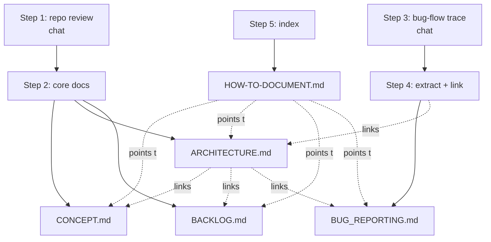

# How To Document — Session Playbook

A record of the prompts used in this documentation session and the files each one
produced. Use it as a reusable recipe: the same prompt sequence will regenerate or extend
this documentation set on another repo or after major changes.

> **The pattern:** *explore → generate core docs → drill into a subsystem → extract it to
> its own doc → index the whole effort.* Each step builds on the context gathered by the
> previous one.

---

## Output files at a glance

| Document | Purpose | Created by step |
|---|---|---|
| [CONCEPT.md](CONCEPT.md) | Product vision, core experience, design principles, glossary | Step 2 |
| [ARCHITECTURE.md](ARCHITECTURE.md) | Full system architecture: layers, stack, runtime, API, data model | Step 2 |
| [BACKLOG.md](BACKLOG.md) | Prioritized engineering recommendations (P0–P3) | Step 2 |
| [BUG_REPORTING.md](BUG_REPORTING.md) | End-to-end bug-report → GitHub-issue flow | Step 4 |
| [HOW-TO-DOCUMENT.md](HOW-TO-DOCUMENT.md) | This playbook — prompts + outputs index | Step 5 |

---

## The prompts, in order

### Step 1 — Review the repo (no file; chat only)
> Do a careful review of the repo and let me know all of the frameworks that are available
> as parts of the solution. Review for architectural choices or recommendations, where
> configurations will help.

**What it did.** Surveyed the codebase to inventory every framework (Three.js, Rapier,
cannon-es, MediaPipe, Vercel Blob, Claude, Whisper, Sketchfab) and flagged architectural
tensions (dual physics engines, Three.js version split, unpinned CDN deps, open AI
proxies). Delivered as a chat summary.
**Output.** Chat response only — the groundwork for the docs that follow.

### Step 2 — Generate the core documentation set
> Create a detailed CONCEPT.md, ARCHITECTURE.md of the full system BACKLOG.md for
> recommendations.

**What it did.** Turned the Step 1 review into three durable documents.
**Output.** [CONCEPT.md](CONCEPT.md), [ARCHITECTURE.md](ARCHITECTURE.md),
[BACKLOG.md](BACKLOG.md).

### Step 3 — Drill into a subsystem (no file; chat only)
> From the code, document how to report a bug or issue that gets pushed to github from the
> UX?

**What it did.** Traced the bug-reporting pipeline through the actual code — the UI button
and modal in `world.html`, the screenshot/world-state capture, the `POST /api/bugs`
serverless handler, and the GitHub issue creation. Delivered as a chat explanation with a
flow diagram.
**Output.** Chat response only — the raw material for Step 4.

### Step 4 — Extract the subsystem into its own doc + cross-link
> Create a new bug reporting file with all of this detail; link to it from the architecture
> file.

**What it did.** Promoted the Step 3 explanation into a standalone document and wired it
into the architecture index (intro paragraph + the `api/bugs.js` API-table row).
**Output.** [BUG_REPORTING.md](BUG_REPORTING.md); edits to [ARCHITECTURE.md](ARCHITECTURE.md).

### Step 5 — Index the documentation effort
> Create a document called HOW-TO-DOCUMENT.md that highlights the prompts from the
> beginning of this session and points to the output files that have been created.

**What it did.** Produced this playbook mapping each prompt to its output.
**Output.** [HOW-TO-DOCUMENT.md](HOW-TO-DOCUMENT.md) (this file).

---

## How the documents relate

---

## Reusing this recipe

1. **Start with a read-only review prompt** so the assistant builds shared context before
   writing anything.
2. **Ask for the core docs together** (concept + architecture + backlog) so they
   cross-reference consistently.
3. **Drill into one subsystem at a time** with a "from the code, document X" prompt — it
   forces the explanation to be grounded in real files, not assumptions.
4. **Promote good chat answers into files** and ask for cross-links so the doc set stays
   navigable.
5. **Finish with an index** (like this file) so future readers can find the entry points.

**Tips that kept output accurate here:**
- Phrase subsystem prompts as *"from the code, …"* to anchor answers to actual files.
- Ask for cross-links explicitly; docs don't link themselves.
- Keep recommendations in one place ([BACKLOG.md](BACKLOG.md)) and reference them from
  detail docs rather than duplicating.
